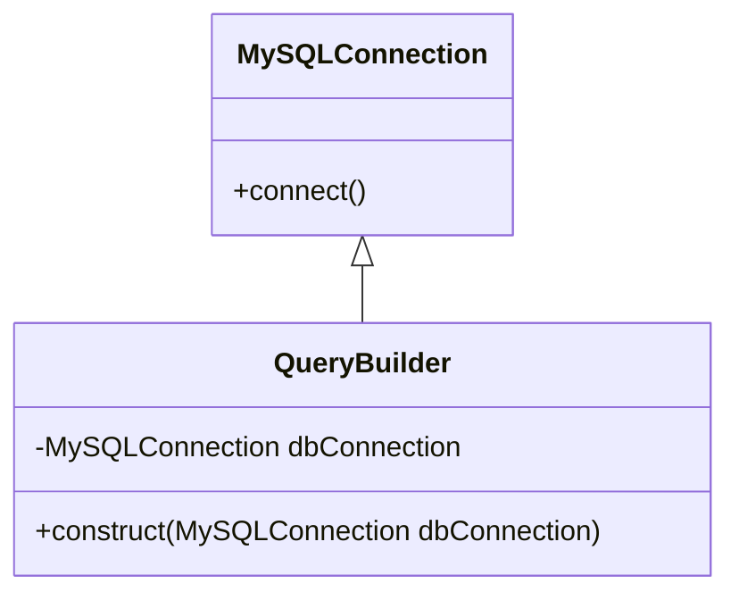
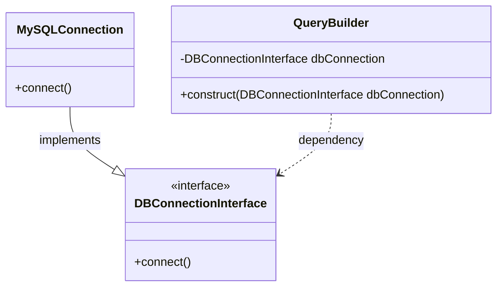

# Dependency Inversion Principle

Dependency inversion principle states:

> Entities must depend on abstractions, not on concretions. It states that the high-level module must not depend on the low-level module, but they should depend on abstractions. 

Let's see the following UML that violates this principle.

This principle allows for decoupling your \Class. According to the definition of D in *SOLID*, which states to *Depend on abstraction, not on concretions.* So, if you were to change the database engine, you would also have to edit the **QueryBuilder** \Class, and this would violate the open-close principle.

The **QueryBuilder** \Class should not care what database driver your apploication uses. To address these issues, you can code to an interface since high-level and low-level modules should depend on abstraction:

This establishes that both the high-level and low-level modules depend on abstraction.