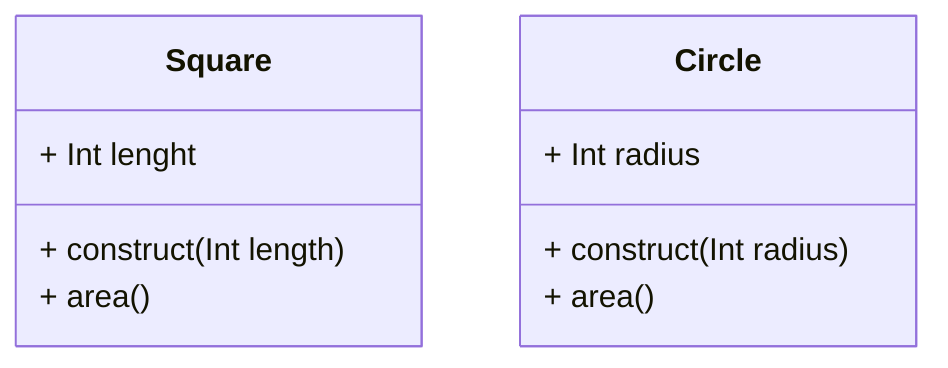
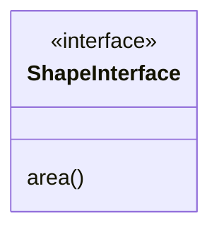
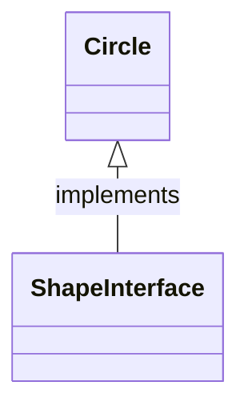

# Open-Closed Principle

Open-closed Principle (OCP) states:

> Objects or entities should be open for extension but closed for modification.
 
This means that a class should be extendable without modifying the class itself.

Let's review **AreaCalculator** \Class and focus on the **sum** method:

```php
namespace Solid\Conceptual\Single;

class AreaCalculator
{
    protected $shapes;

    public function __construct($shapes = [])
    {
        $this->shapes = $shapes;
    }

    public function sum()
    {
        $area = [];
        foreach($this->shapes as $shape)
        {
            if($shape instanceof Square) {
                $area[] = pow($shape->length, 2);
            }else if( $shape instanceof Circle) {
                $area[] = pi() * pow($shape->radius, 2);
            }
        }
        return array_sum($area);
    }    
}
```
Consider a scenario where the user would like the **sum** of additional shapes like triangles, pentagonos, etc.
You would have to constantly edit this file and add more **if/else** blocks.



Now, the **AreaCalculator** \class can calculate the sum without breaking the code.

```php
namespace Solid\Conceptual\Open;

class AreaCalculator
{
    protected $shapes;

    public function __construct($shapes = [])
    {
        $this->shapes = $shapes;
    }

    public function sum()
    {
        $area = [];
        foreach($this->shapes as $shape)
        {
            $area[] = $shape->area();
        }
        return array_sum($area);
    }    
}
```

Coding to an **Interface** is an integral part of SOLID. It is a way to know that the object
passed into the **AreaCalculato** is actually a shape and it has a method defined as **area**.



```php
interface ShapeInterface
{
    public function area();
}
```



```php
class Square implements ShapeInterface
{
    // ...
}
```