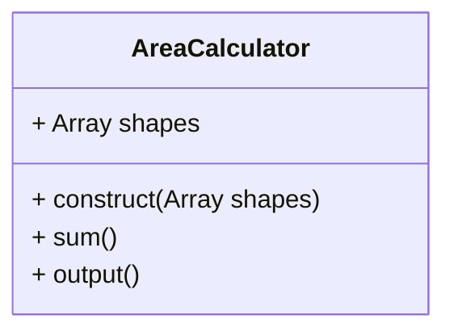
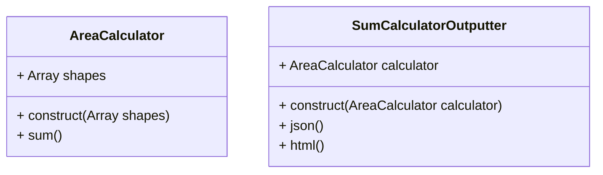

# Single-Responsibility Principle

Single-responsibility Principle (SRP) states:

> A \Class should have one and only one reason to change, meaning that a class should have only one job.
 
 Considering an application that takes a collection and calculates the sum of the area of all collection.

 ```mermaid
classDiagram
class Square {
+ Int lenght
+ construct(Int length)
}

class Circle {
+ Int radius
+ construct(Int radius)
}
```

Next, create the **AreaCalculator** \class and then write up the logic to sum up the areas of all provided collections.


The problem with the ouput method is that the **AreaCalculator** violate the single-responsibility principle. Consider a scenario where output should be converted to another format like JSON. The **AreaCalculator** should only be concerned with the sum of the areas of provided shapes. We'll need create a separate \Class to handle the logic of output.


 
Now, the logic you need to output the data to the user is handdle by the **SumCalculatorOutputter** \Class.
 
```php
	$shapes = [
	new Circle(2),
	new Square(4),
	new Square(6)
	];
	
	$areas = new AreaCalculator($shapes);
	$output = new SumCalculatorOutputter($areas);
	
	echo $output->json();	
	echo $output->html();
```